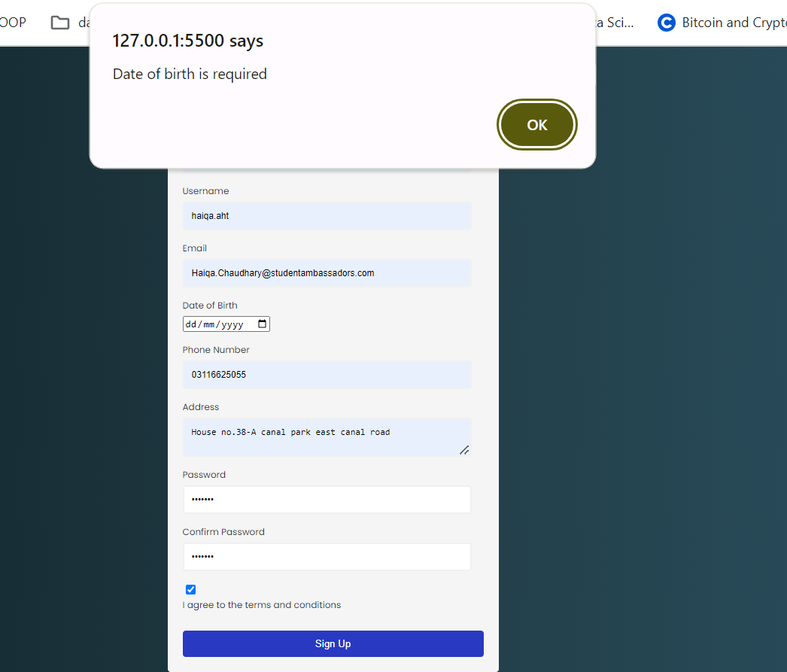

# Sign Up and Sign In Pages

This repository contains the implementation of Sign Up and Sign In pages for a web application.

## Sign Up Page

The Sign Up page allows new users to register for the service. It includes a form with several fields for users to input their information and register. The page also implements front-end validation to ensure that users provide valid information.

### Snapshot:

 
#### Email is not properly formatted

#### if password is not 8 characters long and does not contain special characters

#### phone number must be of 10 digits 

#### refill the form
 
#### date of Birth is required

#### Username or any other feild is Left empty an alert msg is diaplayed

#### If dont agree to Terms and Conditions
---

## Sign In Page

The Sign In page allows registered users to log in to the service. It includes a form with fields for users to input their username and password. Additionally, it includes a checkbox to confirm that the user is not a robot.

### Snapshot:
### Successul Signin

### If A feild is kept Empty:

### If checkbox is not marked
